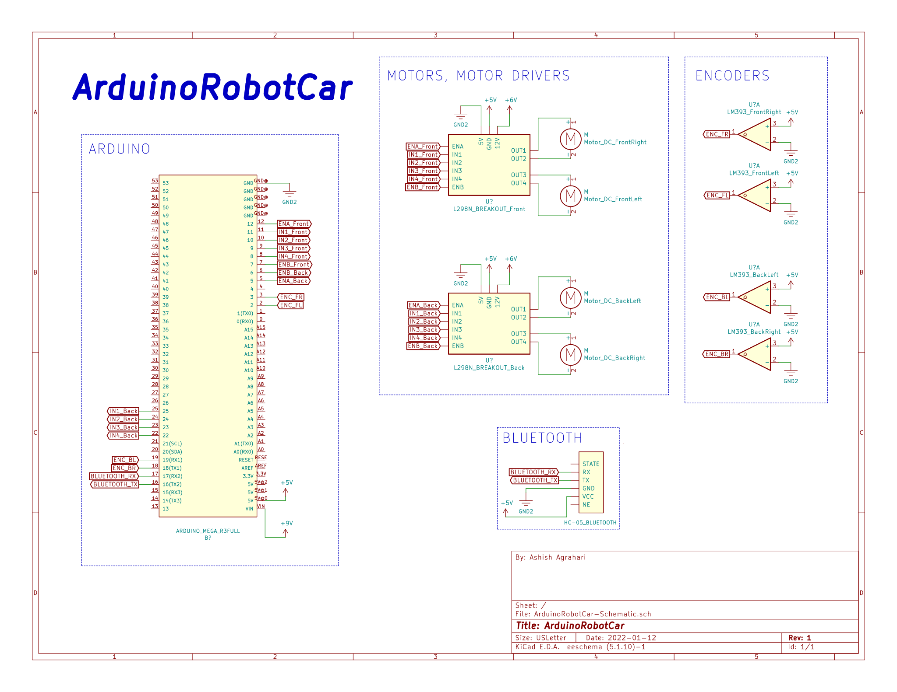

# ArduinoRobotCar
A robot car that drives a certain number of centimeters based on the value from the speed encoders. Made using PlatformIO.

This was a project meant to be a starting place for many other projects to branch off of.

## Schematic

## Links
- https://www.youtube.com/watch?v=uW8YVcBjPGU
- https://www.youtube.com/watch?v=JmvMvIphMnY
- https://www.youtube.com/watch?v=oQQpAACa3ac
- https://dronebotworkshop.com/robot-car-with-speed-sensors/
- https://www.youtube.com/watch?v=lhGXAJj8rJw
- https://www.youtube.com/watch?v=dyjo_ggEtVU
- https://howtomechatronics.com/tutorials/arduino/arduino-dc-motor-control-tutorial-l298n-pwm-h-bridge/
- https://www.youtube.com/watch?v=EBlHNBNHESQ
- https://www.youtube.com/watch?v=dTGITLnYAY0
- https://www.youtube.com/watch?v=3ozgxPi_tl0 
- https://www.youtube.com/watch?v=xTILIkExKZo
